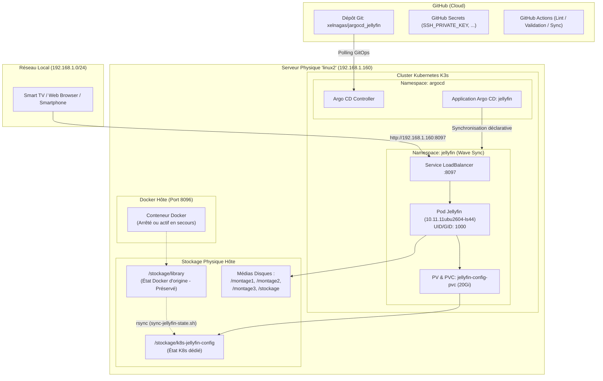

# Manuel d'Exploitation et Documentation du Projet GitOps Jellyfin

Ce manuel détaille le fonctionnement, l'architecture, les procédures d'installation, d'exploitation et de dépannage du projet **Jellyfin GitOps avec Argo CD**.

---

## 📌 1. Présentation Générale

Ce projet permet de déployer et de gérer automatiquement un serveur multimédia **Jellyfin** sur un cluster Kubernetes (**K3s**) en suivant les principes **GitOps** via **Argo CD**.

### Caractéristiques Principales
- **Source Unique de Vérité (SSoT)** : Le dépôt GitHub [https://github.com/xelnagas/jargocd_jellyfin.git](https://github.com/xelnagas/jargocd_jellyfin.git) pilote l'état désiré du cluster.
- **Port d'exposition local** : **`8097`** (accessible sur tout le réseau local `192.168.1.0/24` via le LoadBalancer natif K3s Klipper).
- **Continuité & Zéro Régression** : Reprise intégrale de l'état, des comptes, favoris et historiques de lecture de l'ancien Jellyfin Docker (`/stockage/docker/jellyfin`).
- **Indépendance Docker (Anti-Corruption)** : Stockage dédié dans `/stockage/k8s-jellyfin-config` pour éviter tout verrouillage SQLite avec l'ancien conteneur Docker, qui peut être relancé à tout instant sans risque.
- **Gestion Sécurisée des Secrets** : Secrets centralisés dans **GitHub Secrets** (aucun mot de passe ni clé privée commité en clair).

---

## 🗺️ 2. Schéma d'Architecture & Flux de Données



---

## 🗂️ 3. Structure du Répertoire

```text
.
├── .github/
│   └── workflows/
│       ├── validate.yaml              # Validation Kustomize et conformité anti-:latest
│       └── sync-secrets.yaml          # Injection des secrets GitHub vers le namespace argocd
│
├── apps/
│   └── workloads/
│       └── jellyfin.yaml              # Manifeste de l'Application Argo CD
│
├── manifests/
│   └── workloads/
│       └── jellyfin/
│           ├── base/                  # Socle applicatif
│           │   ├── namespace.yaml     # Création du namespace jellyfin (Wave -2)
│           │   ├── deployment.yaml    # Déploiement Jellyfin (Wave 2)
│           │   ├── service.yaml       # Exposition LoadBalancer port 8097 (Wave 1)
│           │   ├── pv-pvc.yaml        # Persistance /config et montages disques (Wave 0)
│           │   └── kustomization.yaml # Assemblage de base
│           └── overlays/
│               └── prod/              # Environnement Production
│                   └── kustomization.yaml
│
├── bootstrap/
│   ├── github-secrets-guide.md        # Guide de saisie des secrets dans GitHub
│   └── repo-secret.template.yaml      # Modèle de Secret SSH pour Argo CD
│
├── scripts/
│   └── sync-jellyfin-state.sh         # Script utilitaire de copie à chaud de l'état Docker
│
├── normeetprojet.md                   # Charte de gouvernance GitOps
├── actions.md                         # Plan de réalisation technique
├── README.md                          # Documentation générale
└── manuel.md                          # Ce manuel d'exploitation complet
```

---

## 🚀 4. Guide de Démarrage & Déploiement

### Étape 1 : Préparation du Répertoire de Stockage K8s (Serveur 192.168.1.160)
Sur le serveur maître `192.168.1.160` en tant qu'utilisateur `julien` :

1. Exécutez le script de copie d'état pour créer le duplicata sécurisé :
   ```bash
   chmod +x scripts/sync-jellyfin-state.sh
   ./scripts/sync-jellyfin-state.sh
   ```
   *Ce script copie `/stockage/library/` vers `/stockage/k8s-jellyfin-config/` en conservant l'appartenance `julien:julien` (`UID 1000:1000`). Le dossier d'origine Docker reste inchangé.*

### Étape 2 : Configuration des Secrets GitHub
1. Rendez-vous sur votre dépôt GitHub : `https://github.com/xelnagas/jargocd_jellyfin/settings/secrets/actions`
2. Ajoutez le secret suivant :
   - **Nom** : `SSH_PRIVATE_KEY`
   - **Valeur** : Contenu complet de votre clé privée `C:\Users\julien\.ssh\id_ed25519` (avec les lignes d'en-tête et de fin).

*(Optionnel)* : Si le dépôt GitHub est public, aucun secret SSH n'est nécessaire pour le clonage d'Argo CD.

### Étape 3 : Déploiement de l'Application dans Argo CD

#### Option A : Via `kubectl` sur le serveur maître
```bash
kubectl apply -f apps/workloads/jellyfin.yaml
```

#### Option B : Via l'interface web Argo CD
1. Connectez-vous sur l'interface web Argo CD (`https://192.168.1.160:8080`).
2. Cliquez sur **New App**.
3. Renseignez :
   - **Application Name** : `jellyfin`
   - **Project Name** : `default`
   - **Sync Policy** : `Automatic` (cocher `Prune Resources` et `Self Heal`)
   - **Repository URL** : `https://github.com/xelnagas/jargocd_jellyfin.git`
   - **Revision** : `main` (ou `HEAD`)
   - **Path** : `manifests/workloads/jellyfin/overlays/prod`
   - **Cluster URL** : `https://kubernetes.default.svc`
   - **Namespace** : `jellyfin`
4. Cliquez sur **Create**.

---

## 📺 5. Accès et Vérification

### 5.1. Accès Utilisateur Final
Ouvrez votre navigateur ou l'application Jellyfin (TV, smartphone, tablette) :
- **URL locale** : **`http://192.168.1.160:8097`**
- Vos utilisateurs, mots de passe, jaquettes et reprises de lecture sont immédiatement disponibles.

### 5.2. Vérification des Ressources Kubernetes
Depuis le serveur maître :
```bash
# Vérifier l'état des composants
kubectl get all,pvc,pv -n jellyfin

# Suivre les journaux applicatifs en direct
kubectl logs -n jellyfin -l app.kubernetes.io/name=jellyfin -f
```

---

## 🛠️ 6. Procédures d'Exploitation Courante

### 6.1. Effectuer une Modification (Workflow GitOps)
Ne modifiez **jamais** les ressources directement sur le cluster avec `kubectl edit`. Respectez le cycle GitOps :

1. Modifiez les fichiers en local dans votre environnement de développement :
   - Exemple : modifier les limites de mémoire dans `manifests/workloads/jellyfin/base/deployment.yaml`.
2. Validez syntaxiquement la compilation :
   ```powershell
   kubectl kustomize manifests/workloads/jellyfin/overlays/prod
   ```
3. Commitez et poussez les changements :
   ```powershell
   git add .
   git commit -m "chore(jellyfin): ajustement des ressources memoire"
   git push origin main
   ```
4. Argo CD détecte le commit et applique automatiquement la mise à jour sur le cluster sous 3 minutes (ou instantanément en cliquant sur **Sync** dans l'UI).

### 6.2. Procédure de Bascule / Redémarrage du Conteneur Docker (Secours)
Le conteneur Docker original d'écoute sur le port `8096` est entièrement découplé :

- **Pour arrêter le conteneur Docker d'origine** :
  ```bash
  cd /stockage/docker/jellyfin && docker compose stop
  ```
- **Pour relancer le conteneur Docker d'origine (Rollback / Secours immédiat)** :
  ```bash
  cd /stockage/docker/jellyfin && docker compose start
  ```
  Le conteneur repartira sur le port `8096` avec son état `/stockage/library` préservé.

---

## 🔍 7. Guide de Dépannage (Troubleshooting)

### Problème 1 : `Resource not found in cluster: v1/PersistentVolumeClaim`
- **Cause** : Le namespace cible n'a pas été créé avant le PVC.
- **Résolution** : Le fichier `namespace.yaml` est configuré avec l'annotation `argocd.argoproj.io/sync-wave: "-2"`. Cliquez sur **Refresh** puis **Sync** dans Argo CD.

### Problème 2 : `ImagePullBackOff` ou `rpc error: code = NotFound`
- **Cause** : Le tag de l'image LinuxServer ne correspond pas exactement au registre.
- **Résolution** : Le tag officiel exact est `10.11.11ubu2604-ls44`. Vérifiez que [deployment.yaml](file:///d:/devia/argocd/argocd/manifests/workloads/jellyfin/base/deployment.yaml) contient bien `image: lscr.io/linuxserver/jellyfin:10.11.11ubu2604-ls44`.

### Problème 3 : Le Pod reste en `Pending`
- **Cause** : Le planificateur Kubernetes ne trouve pas de nœud correspondant au `nodeSelector`.
- **Résolution** : Le pod nécessite le nœud `linux2` (`nodeSelector: kubernetes.io/hostname: linux2`). Vérifiez que le nœud est prêt avec :
  ```bash
  kubectl get nodes
  ```

### Problème 4 : Le port `8097` n'est pas joignable depuis le réseau local
- **Cause** : Le pod Klipper LoadBalancer de K3s n'a pas lié le port.
- **Résolution** : Vérifiez que le service est bien de type `LoadBalancer` :
  ```bash
  kubectl get svc -n jellyfin jellyfin
  ```
  L'`EXTERNAL-IP` doit afficher l'IP de vos nœuds (notamment `192.168.1.160`).

---

## 📞 8. Références Utiles
- **Dépôt GitHub** : [https://github.com/xelnagas/jargocd_jellyfin.git](https://github.com/xelnagas/jargocd_jellyfin.git)
- **Documentation Jellyfin** : [https://jellyfin.org/docs/](https://jellyfin.org/docs/)
- **Documentation Argo CD** : [https://argo-cd.readthedocs.io/](https://argo-cd.readthedocs.io/)
- **Image Docker LinuxServer Jellyfin** : [https://docs.linuxserver.io/images/docker-jellyfin](https://docs.linuxserver.io/images/docker-jellyfin)
